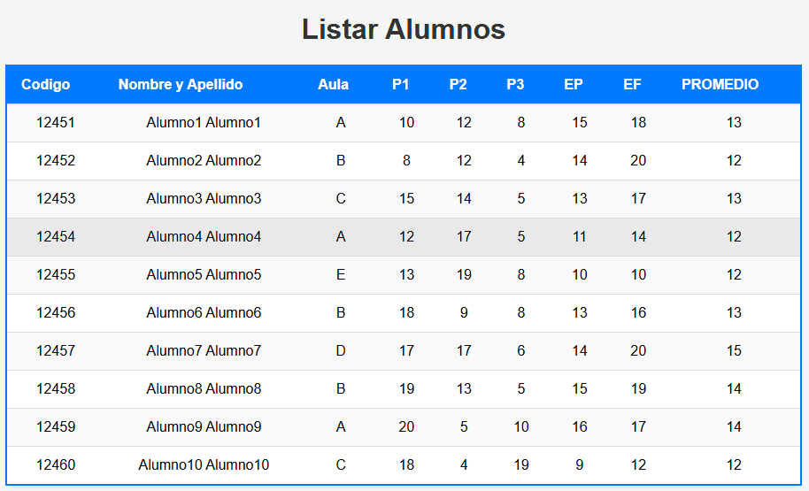

# Sistema de Listado de Alumnos con Promedios

Esta actividad consiste en una aplicación web para listar y mostrar información de alumnos, incluyendo sus datos personales y calificaciones. La aplicación calcula y presenta el promedio de las notas de los estudiantes en una tabla interactiva. Este proyecto demuestra el uso de HTML, CSS y PHP para la creación de una interfaz de usuario amigable y la interacción con una base de datos MySQL.

<p align="center">
  
</p>

**PHP y Manejo de Datos**

- **Conexión a la Base de Datos:** Establece la conexión con la base de datos MySQL.

- **Consulta SQL:** Ejecuta una consulta para obtener los datos de los alumnos y calcular el promedio de sus notas.

- **Generación Dinámica de la Tabla:** Itera sobre los resultados de la consulta y genera las filas de la tabla HTML con los datos obtenidos.

Esta actividad demuestra habilidades en la creación de interfaces web dinámicas, la integración de bases de datos y el procesamiento de datos del lado del servidor, ofreciendo una solución completa para el manejo y visualización de información académica.

**Consulta la versión preliminar de la actividad aquí:** [https://ejercicio_09.com](https://alejandrovillegas.net/projects/exercise-09/index.php)

# 📌 Información de la Actividad

Esta actividad ha sido desarrollado como parte del portafolio de soluciones tecnológicas, con el objetivo de ofrecer una herramienta eficiente y funcional para usuarios autodidactas interesados en la gestión y desarrollo de proyectos web.

- **Área**: Desarrollo de Actividades Web

- **Usuario Final**: TecNM

- **Fecha de Desarrollo**: 14 de septiembre de 2018

- **Portafolio de Proyectos**: [www.alejandrovillegas.net](https://www.alejandrovillegas.net/)

# Guía de Instalación y Configuración

## 🖥️ Requisitos del Sistema

Para ejecutar esta actividad de manera local, es necesario contar con un entorno de desarrollo que incluya Apache, MySQL y PHP. Se recomienda el uso de **XAMPP**, ya que fue el entorno con el que se desarrolló la actividad. Sin embargo, también es compatible con:

- **XAMPP** (Windows, macOS, Linux)

- **WAMP** (Windows)

- **MAMP** (macOS, Windows)

- **LAMP** (Linux)

## 🔧 Instalación y Configuración de la Actividad

Siga los pasos según el entorno de desarrollo que esté utilizando:

### Para XAMPP (Recomendado)

1. Descargue y descomprima el archivo de la actividad en su sistema local.

2. Copie la carpeta de la actividad y colóquela en el directorio **_htdocs_** dentro de la carpeta de instalación de XAMPP (Ejemplo: **C:\xampp\htdocs\mi_actividad**).

### Para WAMP

1. Descargue y descomprima el archivo de la actividad.

2. Copie la carpeta de la actividad y colóquela en el directorio **_www_** dentro de la carpeta de instalación de WAMP (Ejemplo: **C:\wamp64\www\mi_actividad**).

### Para MAMP

1. Descargue y descomprima el archivo de la actividad.

2. Copie la carpeta de la actividad y colóquela en el directorio **_htdocs_** dentro de la carpeta de instalación de MAMP (Ejemplo: **/Applications/MAMP/htdocs/mi_actividad**).

### Para LAMP

1. Descargue y descomprima el archivo de la actividad.

2. Mueva la carpeta de la actividad a **_/var/www/html/_** utilizando el siguiente comando en la terminal:

```
sudo mv mi_actividad /var/www/html/
```

## 🗄️ Configuración de la Base de Datos

### Para XAMPP, WAMP y MAMP

1. Inicie su entorno de desarrollo y asegúrese de que **Apache** y **MySQL** estén en ejecución.

2. Abra su navegador y acceda a **_phpMyAdmin_** ingresando:

- **XAMPP**: http://localhost/phpmyadmin

- **WAMP**: http://localhost/phpmyadmin

- **MAMP**: http://localhost:8888/phpmyadmin

3. Diríjase a la pestaña **SQL** e ingrese el siguiente código para crear la base de datos:

```
CREATE DATABASE General;
```

4. Vaya a la pestaña Importar y seleccione el archivo **_DataBase.sql_** del repositorio para importar la estructura y los datos.

### Para LAMP

1. Abra la terminal y acceda a MySQL con:

```
mysql -u root -p
```

2. Cree la base de datos ejecutando:

```
CREATE DATABASE General;
```

3. Salga de MySQL y luego importe la base de datos con:

```
mysql -u root -p General < /ruta/del/archivo/DataBase.sql
```

Reemplace **_/ruta/del/archivo/_** con la ubicación real del archivo en su sistema.

## 🚀 Ejecución de la Actividad

1. Inicie su entorno de desarrollo:

- **XAMPP**: Abra el "Panel de Control de XAMPP" y active **Apache** y **MySQL**.

- **WAMP**: Haga clic en el icono de WAMP y active los servicios.

- **MAMP**: Abra MAMP y haga clic en **Start Servers**.

- **LAMP**: Ejecute los siguientes comandos en la terminal:

```
sudo systemctl start apache2
sudo systemctl start mysql
```

2. Abra un navegador e ingrese la siguiente URL según el entorno:

- **XAMPP / WAMP**: **_http://localhost/_**

- **MAMP**: **_http://localhost:8888/_**

- **LAMP**: **_http://localhost/_**

La actividad ahora está funcionando en su entorno local. 🎉
